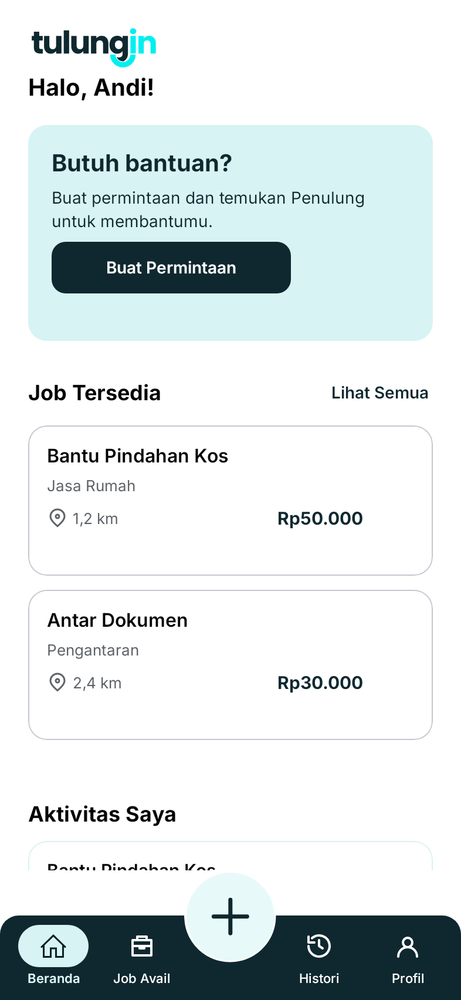
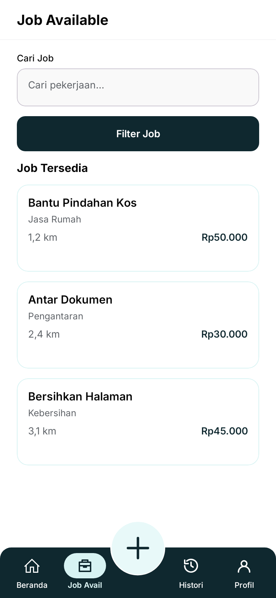
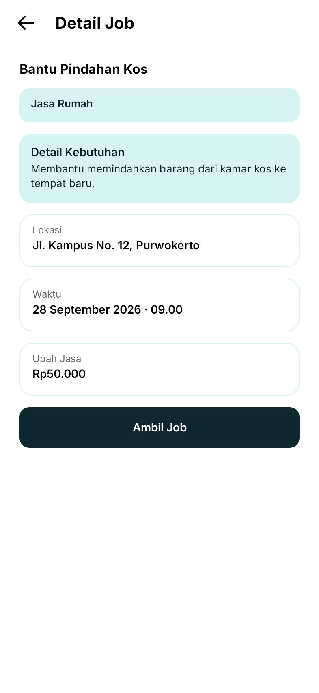
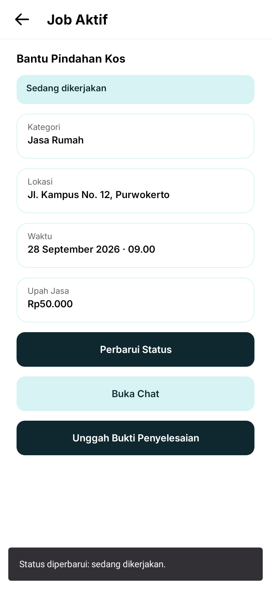
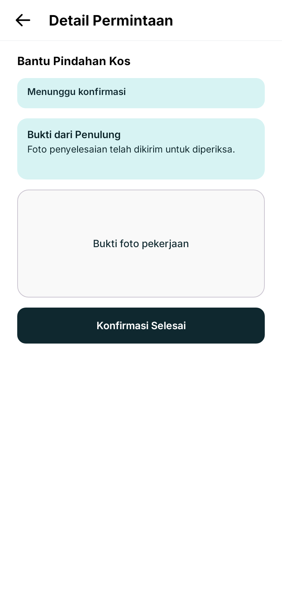
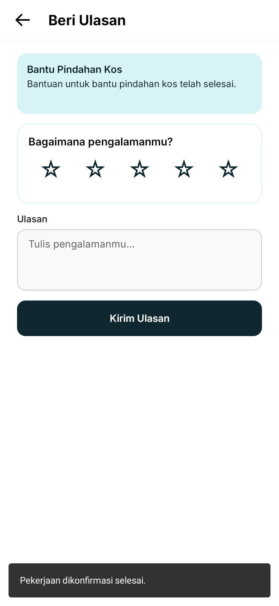
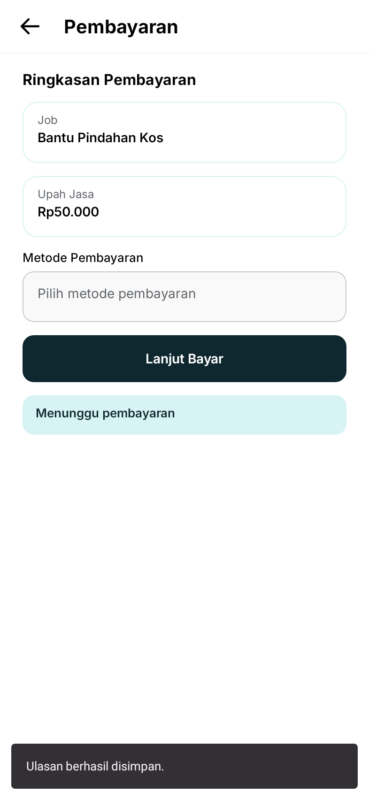
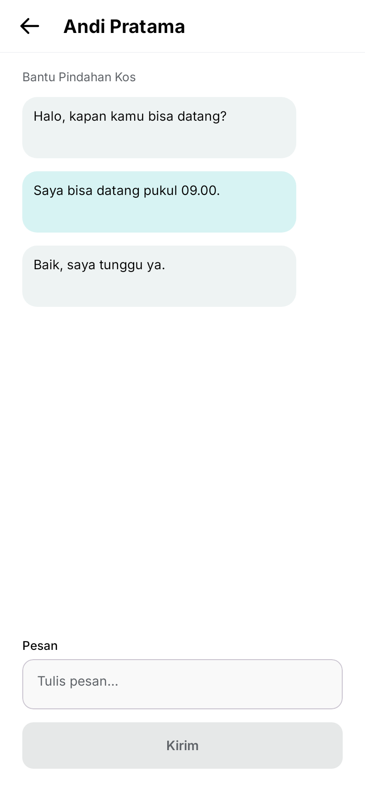
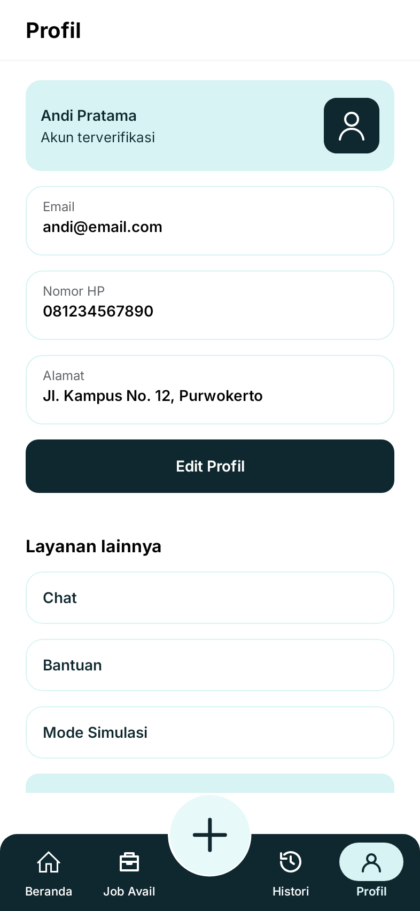

<div align="center">
  
  <br>
  
</div>

# Aplikasi Mobile Tulungin

> **Aplikasi marketplace jasa tolong-menolong & micro-tasking komunitas berbasis Android.**

[](https://kotlinlang.org)
[](https://developer.android.com/compose)
[](https://firebase.google.com)
[](https://developer.android.com)

---

## 📱 Tampilan Antarmuka

| 1. Beranda | 2. Job Available | 3. Detail Job |
| :---: | :---: | :---: |
|  |  |  |

| 4. Job Aktif & Bukti | 5. Konfirmasi Selesai | 6. Rating & Ulasan |
| :---: | :---: | :---: |
|  |  |  |

| 7. Bukti Pembayaran | 8. Chat Real-Time | 9. Profil Pengguna |
| :---: | :---: | :---: |
|  |  |  |

---

## ⚡ Fitur Utama

- **Cari & Filter Pekerjaan**: Eksplorasi permintaan bantuan dengan filter kategori, jarak, dan upah.
- **Buat Permintaan**: Buat permintaan bantuan lengkap dengan judul, deskripsi, lokasi, jadwal, dan estimasi upah.
- **Alur Status Pekerjaan**: `Tersedia` → `Diambil` → `Dikerjakan` → `Konfirmasi` → `Selesai`.
- **Upload Bukti Kerja & Pembayaran**: Penulung dapat mengunggah bukti pengerjaan dan peminta dapat mengunggah bukti pembayaran.
- **Chat Real-Time**: Komunikasi antara peminta dan penulung dalam pekerjaan aktif.
- **Peta & Lokasi**: Menampilkan lokasi pekerjaan menggunakan MapLibre GL.
- **Rating & Ulasan**: Memberikan penilaian dan ulasan setelah pekerjaan selesai.
- **Dashboard Admin**: Mengelola pengguna, kategori pekerjaan, dan job.

---

## 🛠️ Tech Stack

- **Platform & Bahasa**: Android Native, Kotlin 2.2.10
- **UI Framework**: Jetpack Compose, Material 3
- **Arsitektur**: MVVM (Model-View-ViewModel), StateFlow & Coroutines
- **Backend & Database**: Firebase Authentication & Cloud Firestore
- **Authentication**: Email/Password & Google Sign-In
- **Penyimpanan Media**: Cloudinary Android SDK
- **Peta & Lokasi**: MapLibre GL Native & Google Play Services Location

---

## 🚀 Cara Menjalankan

### 1. Clone Repository

```bash
git clone https://github.com/ninikrahayu/Tulungin.git
cd Tulungin
```

Kemudian buka folder project menggunakan Android Studio.

### 2. Prasyarat

- Android Studio versi terbaru
- Android SDK yang sesuai dengan konfigurasi project
- Emulator atau perangkat fisik dengan Android 10+ (API 29+)

### 3. Konfigurasi Firebase

Project menggunakan Firebase untuk Authentication dan Cloud Firestore.

Pastikan file:

```text
app/google-services.json
```

tersedia di dalam project.

Untuk menggunakan Google Sign-In pada perangkat pengembangan baru, tambahkan **SHA-1 fingerprint** perangkat pengembangan ke Firebase Project Settings, kemudian unduh kembali `google-services.json` apabila diperlukan.

### 4. Menjalankan Aplikasi

**Melalui Android Studio:**

1. Buka project Tulungin.
2. Tunggu proses Gradle Sync selesai.
3. Pilih emulator atau perangkat Android yang terhubung.
4. Klik **Run** atau tekan `Shift + F10`.

**Melalui terminal:**

```bash
./gradlew installDebug
```

Pada Windows PowerShell:

```powershell
.\gradlew.bat installDebug
```

Untuk membuat APK debug:

```bash
./gradlew assembleDebug
```

Hasil APK tersedia di:

```text
app/build/outputs/apk/debug/app-debug.apk
```

---

## 📂 Struktur Project

```text
Tulungin/
├── app/
│   ├── src/main/
│   │   ├── java/com/pemmob/tulungin/
│   │   └── res/
│   ├── google-services.json
│   └── build.gradle.kts
├── gradle/
├── build.gradle.kts
├── settings.gradle.kts
└── README.md
```

---

## 👥 Tim Pengembang

Tulungin dikembangkan sebagai project kelompok untuk memenuhi tugas **Mata Kuliah Pemrograman Mobile**, Program Studi Informatika, Fakultas Teknik, Universitas Jenderal Soedirman.

**Anggota Tim:**
- Muhammad Umar Faiz Alfa Rizqy (H1D024010)
- Sani Aprillia Anjani (H1D024011)
- Ninik Rahayu (H1D024024)
- Yusuf Rafii Ahmad (H1D024049)